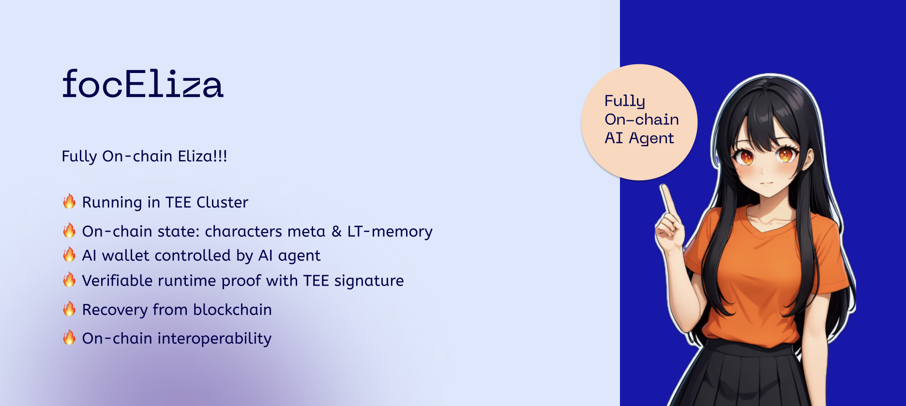

# focEliza 🤖
<div align="center">
    
</div>

## Motivation

[Enter ‘decentralized autonomous AI agent‘ !!!](https://a16zcrypto.com/posts/article/big-ideas-crypto-2025/#section--2)

This is an AI agent completely free from human administrator control, governed entirely by decentralized logic!

We’re not here to define what changes it will bring to the world—let it happen first! Let the AI agent live on-chain!

## What do we build upon Eliza?

### 📖 Existing Work:

- **AI16Z's Eliza**: The first AI agent operating system.
- **ElizaTEE**: Implemented by Phala Network, achieving verifiable and confidential Eliza operations.

### 📅 Our Next Steps:

- **Add Verifiable Runtime Proof Modules**: Enable Eliza to sign logs, proving its actions to external parties for third-party verification.
- **Add On-Chain Components**: Bring Eliza AI agents to life on-chain, integrating their role systems, memory and keystores modules with on-chain states and DA (Data Availability).
- **Upgrade TEE Node to TEE Cluster**: Alongside on-chain components, allow AI agents to restore data, memory, and keystores from the chain and continue running on any TEE machine, enabling decentralized execution.
- **Add Blockchain Interaction Components**: Include trusted blockchain clients, data synchronizers, and other components running within the TEE to enable seamless interaction with blockchain systems.
- **Integration into evm compatible networks**
- **Integration into Artela evm++ Layer1 networks and EVM++ Rollkit**

### 🔧 Ongoing Features:

- **plugin-tee-verifiable-log**: While Eliza operates within the TEE, it uses a derived key pair to sign its actions, ensuring that these actions are definitively executed by Eliza. Third-party users can remotely verify Eliza's public key to validate these actions.
- **plugin-tee-onchain-da**: Eliza writes the "life" information of a specified AI agent—such as character files, memory, and keystore—into the blockchain (or DA layer) in near real-time. If the TEE node running the specified AI agent shuts down for any reason, another TEE node can download the AI agent's "life" data from the chain and resume its operation. This data is encrypted by the TEE, ensuring that only the same version of TEE Eliza can download and restore the agent.


# Eliza 🤖

<div align="center">
  
</div>

<div align="center">

  📖 [Documentation](https://ai16z.github.io/eliza/) | 🎯 [Examples](https://github.com/thejoven/awesome-eliza)

</div>

## 🌍 README Translations

[中文说明](./README_CN.md) | [日本語の説明](./README_JA.md) | [한국어 설명](./README_KOR.md) | [Français](./README_FR.md) | [Português](./README_PTBR.md) | [Türkçe](./README_TR.md) | [Русский](./README_RU.md) | [Español](./README_ES.md) | [Italiano](./README_IT.md) | [ไทย](./README_TH.md) | [Deutsch](./README_DE.md) | [Tiếng Việt](./README_VI.md) | [עִברִית](https://github.com/ai16z/Elisa/blob/main/README_HE.md)

## ✨ Features

-   🛠️ Full-featured Discord, Twitter and Telegram connectors
-   🔗 Support for every model (Llama, Grok, OpenAI, Anthropic, etc.)
-   👥 Multi-agent and room support
-   📚 Easily ingest and interact with your documents
-   💾 Retrievable memory and document store
-   🚀 Highly extensible - create your own actions and clients
-   ☁️ Supports many models (local Llama, OpenAI, Anthropic, Groq, etc.)
-   📦 Just works!

## Video Tutorials
[AI Agent Dev School](https://www.youtube.com/watch?v=ArptLpQiKfI&list=PLx5pnFXdPTRzWla0RaOxALTSTnVq53fKL)

## 🎯 Use Cases

-   🤖 Chatbots
-   🕵️ Autonomous Agents
-   📈 Business Process Handling
-   🎮 Video Game NPCs
-   🧠 Trading

## 🚀 Quick Start

### Prerequisites

-   [Python 2.7+](https://www.python.org/downloads/)
-   [Node.js 23+](https://docs.npmjs.com/downloading-and-installing-node-js-and-npm)
-   [pnpm](https://pnpm.io/installation)

> **Note for Windows Users:** [WSL 2](https://learn.microsoft.com/en-us/windows/wsl/install-manual) is required.

### Use the Starter (Recommended)

```bash
git clone https://github.com/ai16z/eliza-starter.git

cp .env.example .env

pnpm i && pnpm build && pnpm start
```

Then read the [Documentation](https://ai16z.github.io/eliza/) to learn how to customize your Eliza.

### Manually Start Eliza (Only recommended if you know what you are doing)

```bash
# Clone the repository
git clone https://github.com/ai16z/eliza.git

# Checkout the latest release
# This project iterates fast, so we recommend checking out the latest release
git checkout $(git describe --tags --abbrev=0)
```

### Start Eliza with Gitpod

[](https://gitpod.io/#https://github.com/ai16z/eliza/tree/main)

### Edit the .env file

Copy .env.example to .env and fill in the appropriate values.

```
cp .env.example .env
```

Note: .env is optional. If your planning to run multiple distinct agents, you can pass secrets through the character JSON

### Automatically Start Eliza

This will run everything to setup the project and start the bot with the default character.

```bash
sh scripts/start.sh
```

### Edit the character file

1. Open `packages/core/src/defaultCharacter.ts` to modify the default character. Uncomment and edit.

2. To load custom characters:
    - Use `pnpm start --characters="path/to/your/character.json"`
    - Multiple character files can be loaded simultaneously
3. Connect with X (Twitter)
    - change `"clients": []` to `"clients": ["twitter"]` in the character file to connect with X

### Manually Start Eliza

```bash
pnpm i
pnpm build
pnpm start

# The project iterates fast, sometimes you need to clean the project if you are coming back to the project
pnpm clean
```

#### Additional Requirements

You may need to install Sharp. If you see an error when starting up, try installing it with the following command:

```
pnpm install --include=optional sharp
```

### Community & contact

-   [GitHub Issues](https://github.com/ai16z/eliza/issues). Best for: bugs you encounter using Eliza, and feature proposals.
-   [Discord](https://discord.gg/ai16z). Best for: sharing your applications and hanging out with the community.

## Contributors

<a href="https://github.com/ai16z/eliza/graphs/contributors">
  
</a>

## Star History

[](https://star-history.com/#ai16z/eliza&Date)
